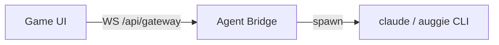

<div align="center">

# Agent Town

### A playable world where AI agents live, work, and collaborate

Your agents deserve more than a terminal. Give them an office, a town, and eventually, a world.

[](./LICENSE)
[](https://nodejs.org)
[](https://www.typescriptlang.org/)
[](https://nextjs.org/)
[](https://phaser.io/)

</div>

---

## Demo

[Watch the demo video](https://github.com/user-attachments/assets/03801c8c-44a5-4b14-96cf-db9e941acf86)

## What is this?

Agent Town is a pixel RPG for your AI workers. You walk around an office as the
boss, assign tasks face-to-face, and watch your agents work in real time — not
in a log, but in the room.

This fork runs entirely on a **local CLI** — no external gateway, no separate
runtime. Every worker is a child process spawned on your own machine. Two
providers are supported, selected at startup with `--provider`:

- **`claude`** _(default)_ — the [Claude Code](https://claude.com/claude-code) CLI,
  with real-time streaming, per-seat model selection, and resumable sessions.
- **`auggie`** — the [Augment](https://www.augmentcode.com/) CLI.

If the provider's CLI works in your terminal, Agent Town works.

## Prerequisites

- **Node.js** ≥ 18
- The CLI for your chosen provider, installed and authenticated:
  - `claude` _(default)_ — verify with `claude --version`
  - `auggie` — verify with `auggie --version`

## Quick Start

```bash
git clone <this-repo>
cd agent-town
pnpm install
pnpm dev
```

Open [http://localhost:3000](http://localhost:3000). Agent Town connects to the
local Claude bridge automatically — there is nothing to configure.

By default, workers operate in the directory you launched Agent Town from.
Point them somewhere else with `--workspace` (or the `CLAUDE_WORKSPACE_DIR`
environment variable).

## Configuration

Everything is optional. Flags are read by the `agent-town` CLI; environment
variables work in every mode.

| Flag / env var                           | Default     | Purpose                                      |
| ----------------------------------------- | ----------- | -------------------------------------------- |
| `--provider` / `AGENT_PROVIDER`            | `claude`    | Agent provider — `claude` or `auggie`        |
| `--port` / `PORT`                          | `3000`      | Port to listen on                            |
| `--workspace` / `CLAUDE_WORKSPACE_DIR`     | launch dir  | Directory Claude workers operate in          |
| `--model` / `CLAUDE_MODEL`                 | `sonnet`    | Default Claude model — `opus`, `sonnet`, `haiku` |
| `CLAUDE_PERMISSION_MODE`                   | `bypassPermissions` | Permission mode for spawned Claude workers |

The `--workspace`, `--model`, and `CLAUDE_*` settings apply to the `claude`
provider only.

> **⚠️ Permissions.** Workers run with `bypassPermissions` so they can edit
> files and run commands without prompting — that is the whole point of an
> autonomous office. They act inside the workspace directory with no
> confirmation. Set `CLAUDE_PERMISSION_MODE` to a stricter mode (`acceptEdits`,
> `default`, `plan`) if you want a tighter blast radius.

Each seat can also override the model individually in the Seat Manager.

## Key features

- **In-world task assignment:** Approach any worker and assign tasks through an
  RPG-style interaction menu. No forms, no dropdowns. You walk up and talk.
- **Visible execution:** Tasks move through `queued > running > done/failed`.
  Worker bubbles stream what's happening; tool calls are collapsible in the
  chat panel — driven by Claude's `stream-json` output in real time.
- **Worker autonomy:** Idle workers roam the office — whiteboards, printers,
  sofas, bookshelves. They return to their seat before starting real work.
  Busy workers queue additional tasks.
- **Session management:** Multiple sessions with quick switching, token/context
  metering, and a seat manager for configuring worker names, roles, sprites,
  and models.
- **Multi-agent delegation:** When you seat more than one worker, the main
  agent gets a `dispatch_to_worker` tool (via MCP) and can hand tasks to
  teammates by seat — you watch the delegated work animate on the target chair.

## How it works

```
You approach a worker -> Press E -> Assign a task
  -> Worker walks back to desk (if away)
  -> The Claude bridge spawns `claude -p --output-format stream-json`
  -> Streaming updates flow back as chat, tool calls, bubbles
  -> Worker completes and picks up the next queued task
```

Conversation continuity is preserved per session: the bridge maps each session
to a `claude` session id and replays `--resume` on follow-up tasks. The map is
persisted to `~/.agent-town/sessions.json` (namespaced by workspace), so workers
remember prior tasks across server restarts.

## Architecture

The browser speaks one frame-based RPC protocol over a WebSocket. It never
talks to a model directly — a **bridge** terminates that protocol and drives
the local CLI. `AGENT_PROVIDER` selects which bridge attaches at startup.



- **Game UI:** Phaser office + React HUD. Talks only to the bridge.
- **Claude bridge** (`lib/claude-bridge.mjs`): spawns one `claude` process per
  task and maps its `stream-json` output onto gateway events — live bubbles,
  collapsible tool calls, token metering.
- **Auggie bridge** (`lib/auggie-bridge.mjs`): the same gateway protocol,
  backed by the `auggie` CLI.
- **MCP dispatch** (`lib/mcp/agent-town-mcp.mjs`): a stdio MCP server attached
  to workers so the main agent can delegate to specific seats.

Both bridges ship with the dev server and the standalone build; only the one
named by `AGENT_PROVIDER` is attached.

## Tech stack

| Layer         | Choice                                              |
| ------------- | --------------------------------------------------- |
| App           | Next.js 16, React 19, TypeScript                    |
| Game          | Phaser 3, Tiled maps, pixel sprite sheets           |
| Agent runtime | Local [Claude Code](https://claude.com/claude-code) or [Auggie](https://www.augmentcode.com/) CLI |
| State         | React context + reducer + typed event bus           |

## Assets

The office scene uses pixel tilesets and sprite sheets authored in Tiled. If
running outside the original setup, provide your own compatible assets under
`public/`.

## Contributing

See [`CONTRIBUTING.md`](./CONTRIBUTING.md). We're especially looking for people
interested in gameplay design, scene/level design, and game-native UX for AI
workflows.

## License

[MIT](./LICENSE)
